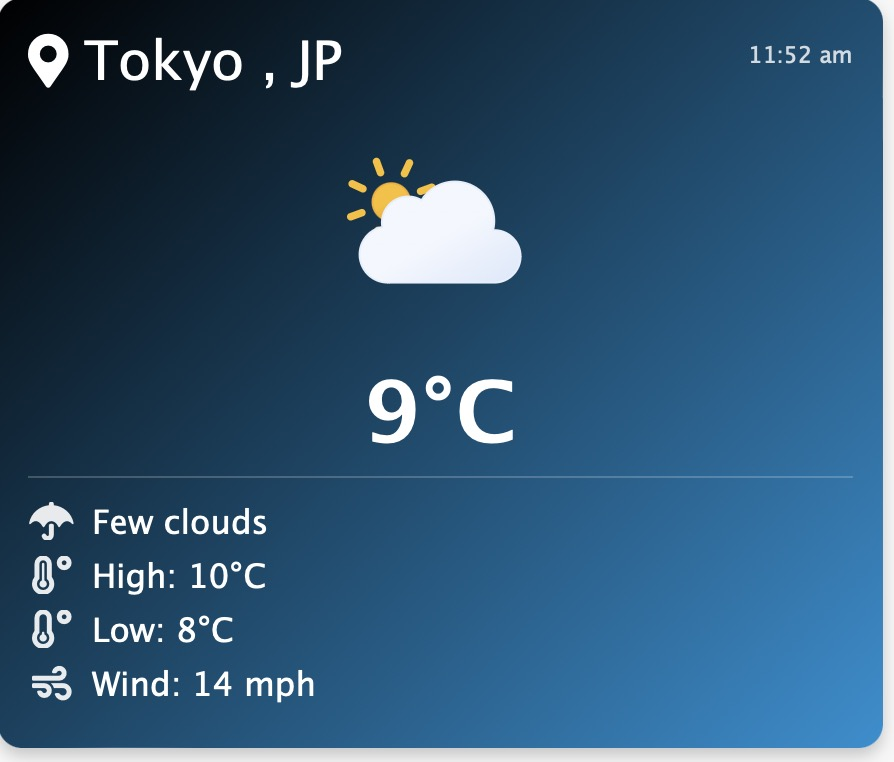

## Animated WordPress Weather Plugin
This is Github source repo for the simple WordPress Animated Weather Plugin, this plugin uses https://openweathermap.org/ to fetch weather based on your location and then through settings allows you to customize the display. Then a clean , light and attractive display is generated using [ meteocons](https://bas.dev/work/meteocons)


Visit the Widget page on the blog for more details about the code.. 
https://www.abrandao.com/2025/01/wordpress-animated-weather-widget/

### Core Features

  - Real-time weather data from OpenWeatherMap API
  - Animated SVG weather icons that change based on conditions
  - Displays temperature in both Fahrenheit and Celsius
  - Shows additional weather details like wind speed and temperature ranges
  - Customizable location settings per widget
  - Admin panel for API key configuration 


You can also customize the CSS , and gradient start and end to match your theme's design. The plugin's use of FontAwesome icons and SVG weather icons ensures crisp, scalable graphics across all device sizes.

### Shortcode Documentation

Shortcode Usage
You can display the weather widget anywhere in your content using the [weather] shortcode.

Advanced Usage
You can customize the widget display using these attributes:

location - City and country code (e.g., "Paris,FR")
temp_unit - Temperature unit ("F" or "C")
show_high_low - Show high/low temperatures ("true" or "false")
show_wind - Show wind speed ("true" or "false")
show_description - Show weather description ("true" or "false")
Examples
```
// Basic example with location
[weather location="Tokyo,JP"]



// Full example with all options
[weather location="Paris,FR" temp_unit="C" show_high_low="true" show_wind="true" show_description="true"]

// Minimal display
[weather location="Rome,IT" show_high_low="false" show_wind="false" show_description="false"]
```

#### Template Usage
To use the shortcode in your template files, use this PHP code:
```php
do_shortcode('[weather location="London,UK" temp_unit="C"]')
```

#### Settings configuration 

You can configure the weather widget settings such as OpenWeathermap API key, default location, which fields to show and hide by logging into your Wordpress Admin dashboar, then choose
`settings >> weather widget` to see the settings below


#### License and Wordpress.org widget details.
Contributors: Tony Brandao ( abrandaocom , abrandao@abrandao.com)
Tags: weather
Requires at least: 6.0
Tested up to: 6.7.1
Stable tag: 1.2
Requires PHP: 7.0
License: GPLv2 or later
License URI: https://www.gnu.org/licenses/gpl-2.0.html
Animated Weather Widget uses openweathermap to show current weather.